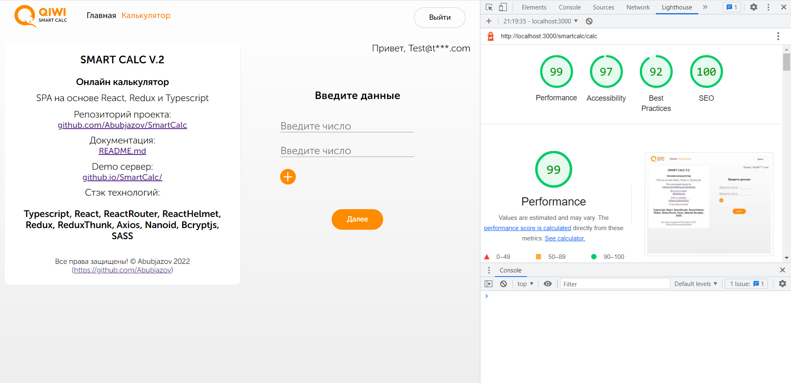

# Онлайн калькулятор `Smart Calc`.

### `SPA` на основе `React, Redux и Typescript`.

**Demo:**<br>
https://abubjazov.github.io/SmartCalc/

**Логин и пароль для Demo:**<br>
`login: test@test.com`<br>
`password: password`

**На данный момент приложение имеет 3 реализованных раздела:**

**[Главная страница]** - первое что видит пользователь.


**[Страница ввода логина и пароля]** - где пользователь уже зарегистрированный в системе может ввести свой логин и пароль и попасть на страницу "Калькулятор".


**[Страница калькулятора]** - где пользователь может ввести данные и получить результат расчёта.


## Покрытие тестами


<br>


## Отчеты Lighthouse

**Страница калькулятора Desktop**


## Структура компонентов


## Стек технологий

```
TypeScript
React
React Router
React Helmet
Redux
Redux Thunk
Axios
Nanoid
Bcryptjs
SASS
```

## Быстрый старт

```
npm install
npm start
```

## Запуск тестов

```
npm run test
```

## Развертывание

```
npm run deploy
```
https://github.com/Abubjazov/SmartCalc/blob/main/docs/Smart_calc.mp4
