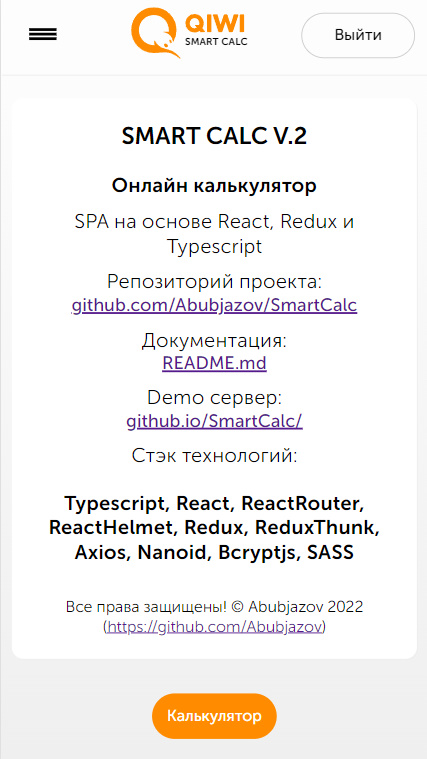

# Smart Calc - простой онлайн калькулятор.

Простое онлайн приложение на основе React, Redux и Typescript.

**Demo:**
Github Pages: https://abubjazov.github.io/SmartCalc/

**Логин и пароль для Demo:**<br>
`login: test@test.com`<br>
`password: password`

**На данный момент приложение имеет 3 реализованных раздела:**

**1) Главная страница** - первое что видит пользователь.



**2) Страница ввода логина и пароля** - где пользователь уже зарегистрированный в системе может ввести свой логин и пароль и попасть на страницу "Калькулятор".


**3) Страница калькулятора** - где пользователь может ввести данные и получить результат расчёта.


## Стек технологий

```
React
React Router
Redux
Redux Thunk
TypeScript
Axios
Nanoid
SASS
```

## Быстрый старт

```
npm install
npm start
```

## Запуск тестов

```
npm run test
```

## Развертывание

```
npm run deploy
```
